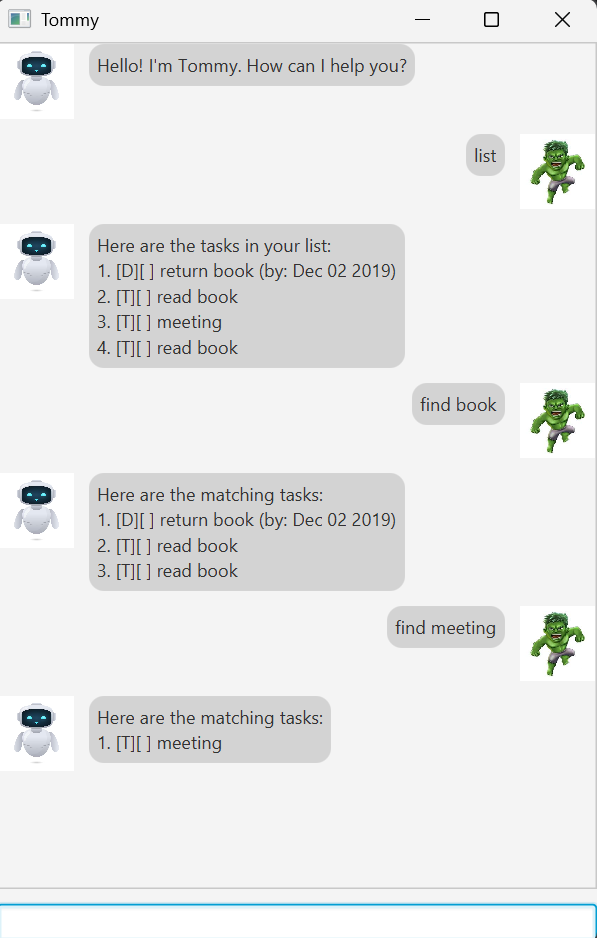

# 📝 Tommy – Your Personal Task Assistant 🤖



> “Your mind is for having ideas, not holding them.” – David Allen

**Tommy** is a lightweight desktop task management chatbot that helps you manage your **todos, deadlines, and events** efficiently. It supports both GUI and CLI interaction and automatically saves your tasks locally.

---

# 📌 Table of Contents

* [Quick Start](#-quick-start)
* [Features](#-features)
* [Command Guide](#-command-guide)
* [Command Summary](#-command-summary)
* [Storage](#-storage)
* [Notes & Constraints](#-notes--constraints)

---

# 🚀 Quick Start

### 1️⃣ Requirements

* Java 17 installed

### 2️⃣ Running the Application

Open a terminal in the folder containing the JAR file and run:

```bash
java -jar duke.jar
```

Tommy will launch in GUI mode by default.

### 3️⃣ Exiting

Type:

```
bye
```

---

# ✨ Features

* ✅ Add Todo tasks
* 📅 Add Deadline tasks
* 📆 Add Event tasks
* ✔ Mark / Unmark tasks
* 🗑 Delete tasks
* 🔍 Search tasks using keywords (partial matches supported)
* 💾 Automatic local storage
* ⚠ Input validation and helpful error messages

---

# 📚 Command Guide

---

## 📋 Viewing Tasks

### `list`

Displays all tasks.

**Format**

```
list
```

---

## 📝 Adding Tasks

### `todo`

Adds a simple task.

**Format**

```
todo DESCRIPTION
```

**Example**

```
todo Read book
```

---

### `deadline`

Adds a task with a due date.

**Format**

```
deadline DESCRIPTION /by yyyy-MM-dd
```

**Example**

```
deadline Submit report /by 2026-02-20
```

---

### `event`

Adds a task with a start and end date.

**Format**

```
event DESCRIPTION /from yyyy-MM-dd /to yyyy-MM-dd
```

**Example**

```
event Project meeting /from 2026-02-15 /to 2026-02-15
```

---

## ✅ Managing Tasks

### `mark`

Marks a task as done.

```
mark INDEX
```

---

### `unmark`

Marks a task as not done.

```
unmark INDEX
```

---

### `delete`

Deletes a task.

```
delete INDEX
```

---

## 🔍 Searching

### `find`

Searches tasks by keyword (case-insensitive, partial matches supported).

```
find KEYWORD
```

**Example**

```
find report
```

---

## 👋 Exit

### `bye`

Closes the application safely.

```
bye
```

---

# 📊 Command Summary

| Command    | Description       |
| ---------- | ----------------- |
| `list`     | List all tasks    |
| `todo`     | Add a todo        |
| `deadline` | Add a deadline    |
| `event`    | Add an event      |
| `mark`     | Mark task as done |
| `unmark`   | Unmark task       |
| `delete`   | Delete task       |
| `find`     | Search tasks      |
| `bye`      | Exit application  |

---

# 💾 Storage

* Tasks are stored in:

  ```
  data/tommy.txt
  ```
* If the file does not exist, Tommy creates it automatically.
* Data persists between sessions.

---

# ⚠ Notes & Constraints

* INDEX is **1-based**.
* Dates must follow `yyyy-MM-dd`.
* Commands are case-insensitive.
* Invalid input will produce helpful error messages.

---

# 🎯 About Tommy

Tommy is designed to be:

* ⚡ Fast
* 🧠 Simple
* 💻 Keyboard-friendly
* 📚 Suitable for students and developers

---
